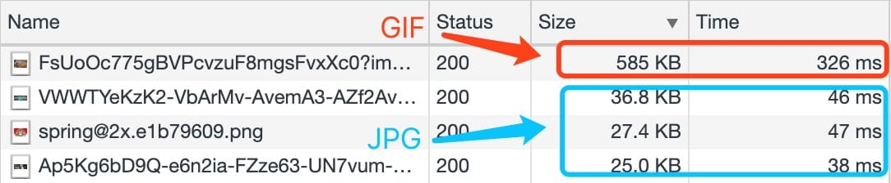
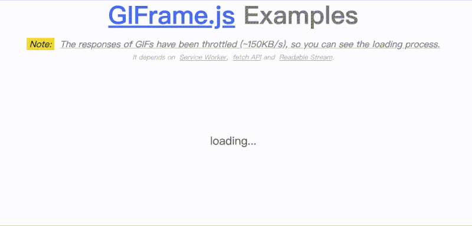
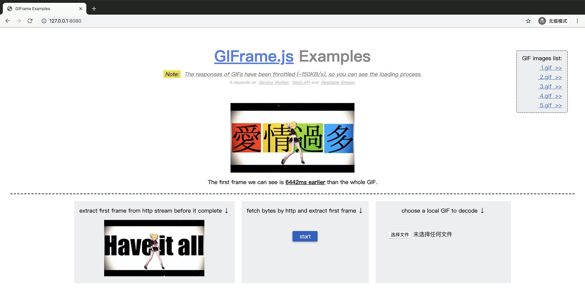
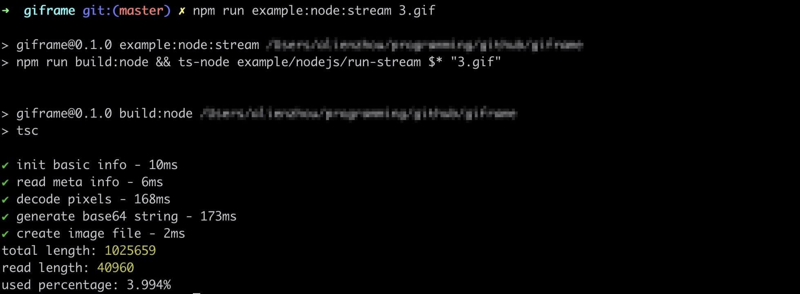

# giframe

Giframe can extract the first frame in GIFs without reading whole bytes in both browsers and NodeJS.

[](https://travis-ci.org/alienzhou/giframe) [](https://www.npmjs.com/package/giframe) [](https://coveralls.io/github/alienzhou/giframe) [](https://unpkg.com/giframe) [](https://codebeat.co/projects/github-com-alienzhou-giframe-master) [](https://opensource.org/licenses/mit-license.php)

It's fast because it can decode chunk by chunk. No need to wait for and read all bytes, especially when only extracting the first frame.

It may be used for improving GIFs loading experiences, providing more controllable GIF loading strategies and so on.

## Motivation

Some websites contain a lot of [GIF images](https://en.wikipedia.org/wiki/GIF). Displaying animation images in your homepage, item list and so on may attract users' attention. However, GIF images are much larger than static images (sometimes 20x~30x depends on how many frames).



As a result, users need to wait for a long time to see GIF images. A common method is to extract the first frame as a placeholder and load GIF lazily when in view or clicked. There are lots of libraries to extract frames in the server-side. However, it has some limitations:

- Most libs need to read whole bytes in GIF for extracting frames, even though we only need the first one. It's a waste of computing and time. For example, the first frame only use about 16% bytes in [`example/img/4.gif`](./example/img/4.gif) (8-frames) and .
- This solution needs the support of the server-side or CDN. Is there any frontend-only solution to improve user experience?

This repository aims to provide a stream-like (decode chunk by chunk) GIF decoder which can run in both browsers (client-side) and NodeJS (server-side).

- It will try to extract the needed frame without reading all bytes. You can read bytes and decode at the same time. It is useful especially when using stream in I/O.
- Running in browsers means you can display a early static frame when downloading GIF, or use the client itself to calculate.

Below is an browser example. _**The first frame is extracted and used as a placeholder while the GIF image is still loading.**_



You can also play with it by yourself. [Go to the `Example` section >>](#Example)

## Basic Usage

Support both in browsers and NodeJS,

```JavaScript
import GIFrame from 'giframe';
const giframe = new GIFrame();
giframe.getBase64().then(base64 => {
    // finally get the base64 string of the first frame
    console.log(base64);
});

// then read GIF bytes from network, local file and so on
const source = readGIF('xxx.gif');
// chunk need to be Uint8Array
source.on('data', chunk => giframe.feed(chunk));
```

More complex usages can be found in `example/` directory. You can also run examples below ↓↓↓

## Example

> [Nodejs](https://nodejs.org/) required.

This repo provides some examples in `example/` which give you a quick start. 

Firstly, clone the repo and install dependencies.

```bash
git clone git@github.com:alienzhou/giframe.git
cd giframe

# install dependencies
npm i
```

Run in browsers,

```bash
npm run example:browser
```

Then it will open http://127.0.0.1:8080 (default port 8080), you will see a demo page ↓



Or run in NodeJS,

```bash
# extract the first frame image
# you can change the gif filename (1.gif ~ 5.gif)
npm run example:node:stream 1.gif

# or you can run
npm run example:node:limit 1.gif

# then the first frame image will be written in example/output
```




## How it works

For a quick and robust start, the decoder is mostly a folk of [omggif](https://github.com/deanm/omggif). GIF is composed of [many blocks](http://matthewflickinger.com/lab/whatsinagif/bits_and_bytes.asp). Giframe treats every block as a valid unit and resets the position to the previous block's end when meet an incomplete block. It will try to continue to decoding when receiving another chunk (more bytes). It's like stream.

To generate the image's base64, Giframe uses the Canvas API - [node-canvas](https://github.com/Automattic/node-canvas) in NodeJS and [native canvas](https://developer.mozilla.org/en-US/docs/Web/API/Canvas_API) in browsers. The canvas uses all RGBA pixels which are provided by Giframe to render a image and exports base64 string by `.toDataURL()`.

By the way, the example in `example/browser` uses [Service Worker](https://developer.mozilla.org/en-US/docs/Web/API/ServiceWorker), [`fetch` event](https://developer.mozilla.org/en-US/docs/Web/API/FetchEvent), [fetch API](https://developer.mozilla.org/en-US/docs/Web/API/Fetch_API) and [Readable Stream](https://developer.mozilla.org/en-US/docs/Web/API/ReadableStream/ReadableStream). It tees a stream from the response in fetch API and read it. Every chunk received will be used to decode progressively. Once the first frame is ready, it will be displayed on screen as a static preview.

## License

[MIT](./LICENCE)
